# PHP-JOIN-PAYMENT php 支付工程
github (最新代码)  https://github.com/SantiagoFan/php-payment  
gitee (定期同步)  https://gitee.com/san_fan/php-paymentgit
### 整体框架


### composer 安装
需要 composer 版本2+
```
composer require join/php-payment
```
包地址
https://packagist.org/packages/join/php-payment

### require 依赖

php：>=7.2.0

## 代码结构


### 如何参与开发成为代码贡献人员

1. 将项目fork到自己帐号
2. 修改代码完成测试
3. 提交commit push 到自己的仓库
3. New pull request(简称pr) 合并请求到主库等待合并


# 使用教程
### 1.安装包 composer 包
```
composer require join/php-payment
```
### 2.创建数据表
复制源码文件夹的sql 脚本创建 交易流水表（此表作为所有支付进出的流水信息记录），具体业务订单信息请自己单独创建，参照下面的myorder
```
vendor/join/php-payment/doc/model.sql
```
### 3.编写配置类（实现 IPaymentConfig 接口）
* getPayConfig 是获取微信支付宝支付通道所需参数的方法  
* getBusinessOrder  是通过业务名称获取 业务类（具体指业务系统里需要有支付需求的订单如，商户购买订单、充值订单等）
* getPayChannel 是前端业务场景对应支付通道的配置
```php
class PaymentConfig implements IPaymentConfig{
    // 注入配置
    public static function init(){
        $config  = new self();
        PayFactory::init($config);
    }
    /**
    * 注入配置信息
    * @param string $type
    * @return mixed
    */
    public function getPayConfig(string $type){
        // 方式一：代码里直接编写参数
//        $config = [
//           "wxpay"=>[],
//           "alipay"=>[]
//        ];
        // 方式二：单独配置文件  config/payment.php
        $config = Config::get('payment.');
        return $config[$type];
    }
    /**
    * 获取业务类实例
    * @param string $business_name
    * @return IPayableOrder
    */
    public function getBusinessOrder(string $business_name): IPayableOrder
    {
        // 具体请映射业务类
        $business_map=[
             "my_order"=> new MyOrder(),
             "my_order2"=>new MyOrder2()
        ];
        return $business_map[$business_name];
    }
    /**
    * 配置客户端 对应支付通道
    * @param string $client
    * @return string
    */
    public function getPayChannel(string $client): string
    {
        // 客戶端支付方式映射支付渠道
        $channel=[
            PayClient::WEIXIN_MP => PayChannel::WEIXIN_PAY_JS,
            PayClient::WEIXIN_QRCODE => PayChannel::WEIXIN_PAY_NATIVE,
            PayClient::ALI_MP => PayChannel::ALI_PAY_JS,
            PayClient::ALI_PAY_QRCODE => PayChannel::ALI_PAY_NATIVE,
        ];
        return $channel[$client];
    }
}
```
配置示例 config/payment.php
```
<?php
use think\facade\Config;
use think\facade\Env;
return [
    // +----------------------------------------------------------------------
    // | 微信 支付参数
    // +----------------------------------------------------------------------
    "wxpay"=>[
        'app_id' => '',
        'mch_id' => '',
        'key' => '',
        'pay_notify_url' =>'https://' . Config::get('app_host') . '/payment/notify/wxpay',
        'refund_notify_url' =>'https://' . Config::get('app_host') . '/payment/notify/wxrefund',
        'cert_path' =>Env::get('root_path'). 'cert/apiclient_cert.pem',
        'key_path' =>Env::get('root_path'). 'cert/apiclient_key.pem'
    ],
    // +----------------------------------------------------------------------
    // | 支付宝 支付参数
    // +----------------------------------------------------------------------
    "alipay"=>[
        'app_id' => '',
        'merchantPrivateKey' => '',
        'alipayPublicKey'=>'',
        'encryptKey'=>'',
        'pay_notify_url' => 'https://' . Config::get('app_host') . '/payment/notify/alipay'
    ]
];
```
支付前注入配置
```php
PaymentConfig::init();
```
### 4.集成异步通知 Controller
此通知入口对应地址需要和配置类的通知地址一致
```php
class NotifyController extends BaseNotifyController
{
    public function __construct(App $app = null)
    {
        parent::__construct($app);
        PaymentConfig::init(); //如果全局钩子函数注入配置则不用写次函数
    }
}
```
如果需要全局处理 支付成功后或者退款后的业务，notify 类覆盖父类方法PaySuccess
或者 RefundSuccess。  
如果需要处理业务订单成功后的业务，请在相关业务model 里的PaySuccess方法处理

### 5.编写业务类 Model
* .编写自己的业务类MyOrder(可以实现多个不同业务类，如商城订单、充值订单，***<font color='red'>MyOrder只是示例名字，具体的写自己的名字</font>***) 。  
* .每个业务需要实现 IPayableOrder 或者直接继承 BasePayableOrder 基类省时省力  
* .BasePayableOrder 集成了 Thinkphp 的Model 类，可直接集成Model的数据库操作函数

```php
class MyOrder extends BasePayableOrder
{
    // 业务名称
    protected $pk ='order_no';
    protected $business_name = 'my_order';
    /**
     * 因为字段不一样 覆盖父级方法
    * 如果业务类包含：title、amount、order_no 则无需编写次方法
     * @return Model_PayOrder
     */
    public function CreatePayOrder():Model_PayOrder
    {
//        $pay_order = new Model_PayOrder();
//        $pay_order['title']= $this['name'];
//        $pay_order['amount']=  $this['price'];
//        $pay_order['business_no']=  $this['order_no'];
//        $pay_order['business_name']= $this->GetBusinessName();
//        return $pay_order;
    }
    public function PaySuccess(Model_PayOrder $pay_order)
    {
        // 支付成功后 业务单 后续逻辑
    }
    public function RefundedSuccess(Model_PayOrder $pay_refund_order)
    {
        // 退款成功后 业务单 后续逻辑
    }
}
```
### 6.编写业务调用支付
```php
        // 方式1：创建自己的业务订单
        // $bus_order =  new MyOrder();
        // $bus_order['name'] ='用户充值';
        // $bus_order['price'] = 11.00;
    
        // 方式2： 从数据库查询 后支付
        $bus_order = MyOrder::get('10001');
        
        //支付客户端类型（就是你想调用哪种支付方式）
        $client = PayClient::WEIXIN_QRCODE; //小程序参数
        $params = [];
        // 获得支付参数
        $res = $bus_order->PayOrder($client, $params);
```